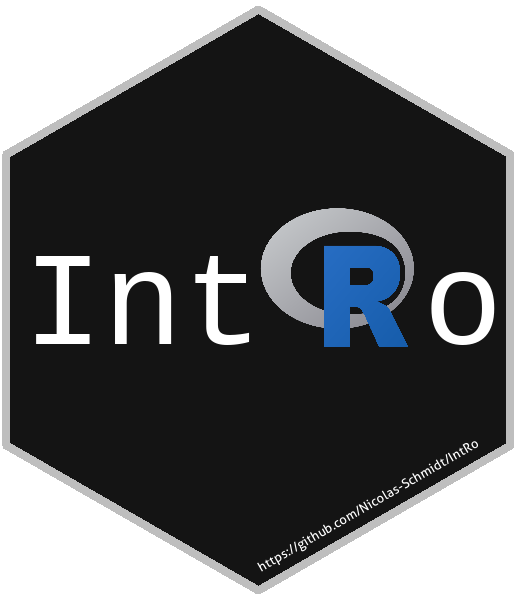

<!-- README.md is generated from README.Rmd. Please edit that file -->

# Introducción al software estadístico R </a>

<!-- badges: start -->

[](https://github.com/Nicolas-Schmidt/IntRo/actions)
[](https://github.com/Nicolas-Schmidt/IntRo)
<!-- badges: end -->

Este es un curso que se dicta en la Facultad de Ciencias Sociales de la
Universidad de la República (Montevideo, Uruguay). En este
[link](https://github.com/Nicolas-Schmidt/IntRo/blob/master/man/Ejercicios/Programa_IntRo.pdf)
puede ver el programa. El paquete `IntRo` fue desarrollado para este
curso. Es para que los estudiantes puedan autoevaluarse los ejercicios
del curso.

Hay un instructivo de uso del paquete
[aquí](https://github.com/Nicolas-Schmidt/IntRo/blob/master/man/Ejercicios/Instructivo_IntRo.pdf).<br />
Las **presentaciones** del curso están
[aquí](https://github.com/Nicolas-Schmidt/IntRo/tree/master/man/Presentaciones).<br />
Código y material adicional
[aquí](https://github.com/Nicolas-Schmidt/IntRo/tree/master/man/Presentaciones/codigo)

Ejercicios:

1.  Módulo
    [vectores](https://github.com/Nicolas-Schmidt/IntRo/blob/master/man/Ejercicios/Ejercicios_Modulo_vectores.pdf)
2.  Módulo
    [matrices](https://github.com/Nicolas-Schmidt/IntRo/blob/master/man/Ejercicios/Ejercicios_Modulo_matrices.pdf)
3.  Módulo
    [data.frame](https://github.com/Nicolas-Schmidt/IntRo/blob/master/man/Ejercicios/Ejercicios_Modulo_dataframe.pdf)
4.  Módulo
    [listas](https://github.com/Nicolas-Schmidt/IntRo/blob/master/man/Ejercicios/Ejercicios_Modulo_listas.pdf)

<br />

¿Cómo enseñar R? Experiencia del curso IntRo. (slides
[aquí](https://github.com/Nicolas-Schmidt/IntRo/blob/master/man/Presentaciones/codigo/aprendeR.pdf))

<br />

#### *_Docentes_*

El docente del curso es Nicolás Schmidt. Mail: <nicoschlab@gmail.com>,
<nschmidt@cienciassociales.edu.uy>

<br />

``` r
print("Bienvenidos al curso IntRo")
#> [1] "Bienvenidos al curso IntRo"
```

<center>

</a>

</center>

<br />

<br />

<br />

-----

En [este](https://github.com/Nicolas-Schmidt/Evaluaciones_IntRo) link se
encuentras las evaluaciones que los estudiantes de las distintas
ediciones han realizado sobre el curso.
